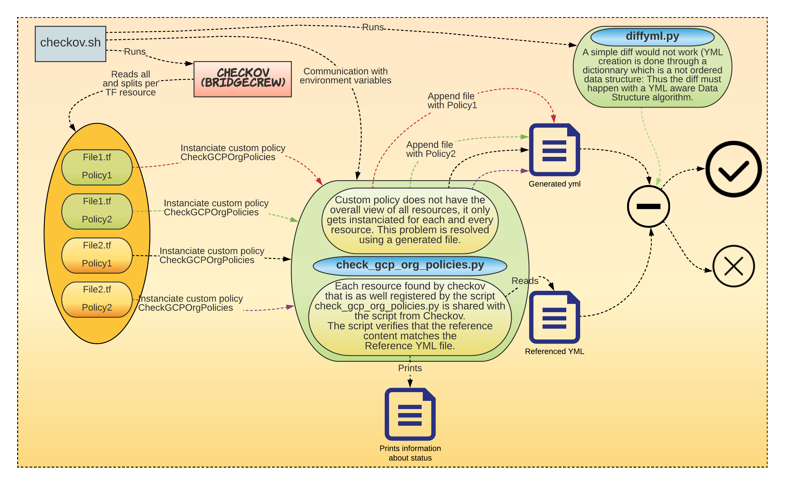

# Google organization policies checker

## When would I need this ?

Say your GCP landing zone is based on Terraform and say you have elevated privileges on your GCP organization which allow you to change the [organisational policies](https://cloud.google.com/resource-manager/docs/organization-policy/org-policy-constraints) at the organization or folder level.

Such changes are very often not covered by separated environments (prod, test, dev): in other words once applied these changes will impact all of your projects whether they are running productive or development workload.

Considering these policies are designed to enhance security, changes could impact projects in such a way that they 

- either would not have enough permission anymore to fulfill their goal 
- or at the opposite suddenly open a security breach.

Assuming for some reason some of these policies were inadvertendly changed, these few scripts will allow you to be informed that something weird is happening.

## How shall I setup my environment ?

It is based on the [custom policies](https://www.checkov.io/3.Custom%20Policies/Custom%20Policies%20Overview.html#:~:text=Custom%20Policies%20allow%20monitoring%20and,with%20your%20organization's%20specific%20needs.&text=You%20can%20create%20custom%20policies%20in%20YAML%20that%20can%20both,state%20between%20types%20of%20resources.) feature of [Checkov](https://bridgecrew.io/checkov/) from Bridgecrew: the tool can be installed from the explanation provided [here](https://github.com/bridgecrewio/checkov). 

This git current project provides a script named ```checkov.sh``` that encapsulates all the complexity. 

### Setup of your environment

I recommend to use a virtual Python environment to make sure you are not poluting your default python environment. Assuming Python3 and checkov are installed:

```shell
$ python3 -m venv checkov-env
$ source checkov-env/bin/activate
$ pip3 install deepdiff 
$ pip3 install checkov
```

You now have all dependencies ready.

As described in the custom policies section, the python files must lie in a created directory where all Terraform files are located. Assuming you have your Terrafom files in a directory named ```mylz```:

```shell
$ ls mylz
myfile1.tf myfile2.tf
```

Then the directory holding the custom polcies should be created in ```mylz```.

However this can be quite some overhead, by chance a symlink works as well. Hence instead of creating and duplicating the custom policies you can use a symlink to the directory holding them. 

This git repository provides the necessary directory. The directory is named: ```checkcov-orgpolicies```. Thus assuming you cloned this repo in a directory named ```path-to-cloned-git-repo```, instead of creating a new directory, you should:

```shell
$ cd mylz
$ ln -s path-to-cloned-git-repo/checkcov-orgpolicies .
```

Your are now ready to initialize the script:

```shell
$ ./checkov.sh -f mylz
```

This will create a new reference yml file defining all the organizational policies you have setup both at the organization and at the folder levels. This yml file must be committed and pushed with your Terraform code.

### Integration in a CI/CD

Once the reference file is properly initialized as explained in the previous section, the script can be used in a CI/CD pipeline using the following command line:

```shell
$ ./checkov.sh mylz
```

This is all. Now, any configuration policy that will be modified without previously properly updating the yml reference file will make your CI/CD pipeline fail.

In order to recover, you will have to either:

- revert the changes of the policies
- update the reference file as mentionned in the previous step, commit it and push it to have your pipeline working again properly.

## All options of the script

```bash
./checkov.sh -h
Usage: ./checkov.sh [-t <terraform directory: default = test>] 
                    [-c <custom_policy_name:default = checkcov-orgpolicies>] 
                    [-f to initialize yaml: will always return an error]
                    [-d for debug] 
                    [-i <input_yml_file:default = org_policies_reference.yaml>] 
                    [-o <output_yml_file:default = generated_org_policies_reference.yaml>] 
                    [-r <list of resources to be checked: default = google_organization_policy,google_folder_organization_policy>]
```


### -t: Terraform directory

This references the directory where the Terraform files should be checked against checkov.

### -c: Custom policy name

A policy name is referenced by the directory it is laying in. This directory should reside together with the Terraform files.
So this should define the name of the directory where the python scripts of the custom policy reside.

### -d: Debug

For checkov experts, this will allow to see the logs of Checkov interleaved with the output regarding the purpose of the script.

### -i / -o: Input and output yml file

You can change the name of the referenced yml files. If you are not sure what that means, leave them as is.

### -r: List of resources to be checked

The list of resources defined here triggers when checkov will call the custom policies according to the resources being scanned.
In other words, if a resource being scanned do not belong to the list provided here, the custom policy will not be triggered against it.

# How does the set of scripts work together ?

The whole setup is composed of the following scripts:

In the top directory:

- checkov.sh: This is the main script
- siffyml.py takes care to diff 2 YML files (See the high level view below for more information).
- ```checkcov-orgpolicies``` is a directory to be linked to from a directory containing the terraform files. It contains the following files:

  - ___init__.py
  - check_gcp_org_policies.py: This is the actual logic representing the custom policy.

In the directory ```test``` (this directory represents a set of TF files to be checked):

- Some faked tf files
- YML files will be created here (See the below picture for more information).
- ```checkcov-orgpolicies``` is a symbolic link to the directory named In the directory ```checkcov-orgpolicies``` located in the parent directory.

See this image for more information:
